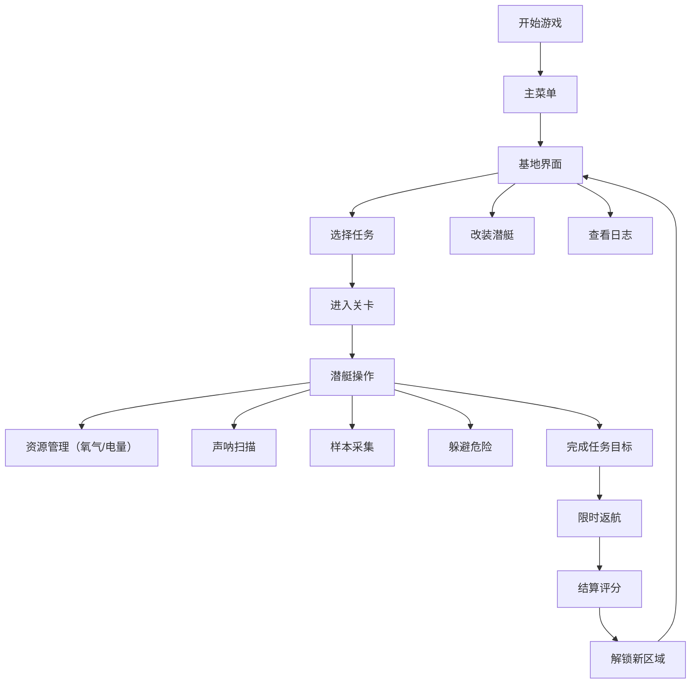

## 1. 产品概述

深海科考潜艇探险是一款2D横版客户端游戏，玩家驾驶小型潜艇在深海完成采样、修理和撤离任务。游戏融合资源管理、动作操作和策略决策，通过7个难度递进的关卡，提供沉浸式的深海探索体验。

- 核心目标：驾驶潜艇完成各类深海科考任务，管理资源，规避危险，解锁新区域
- 目标用户：喜欢探索类、策略类游戏的玩家

## 2. 核心功能

### 2.1 用户角色
| 角色 | 注册方式 | 核心权限 |
|------|----------|----------|
| 玩家 | 本地存档 | 完整游戏体验，包括关卡挑战、潜艇改装、日志收集 |

### 2.2 功能模块
1. **基地界面**：任务选择、潜艇改装、日志收集、区域解锁
2. **关卡系统**：7个独立关卡，各有独特环境和任务目标
3. **潜艇控制系统**：移动、灯光、声呐、机械臂、维修
4. **资源管理系统**：氧气、电量、外壳耐久度
5. **样本系统**：采集、分类、存储、评分
6. **任务系统**：主线任务、可选任务、限时任务
7. **结算系统**：评分、奖励、解锁判定

### 2.3 页面详情
| 页面名称 | 模块名称 | 功能描述 |
|----------|----------|----------|
| 主菜单 | 标题、开始游戏、继续游戏、设置 | 游戏入口，读取/创建存档 |
| 基地界面 | 任务面板 | 查看当前可接任务，选择关卡 |
| 基地界面 | 改装面板 | 升级潜艇部件（引擎、氧气罐、电池、机械臂、声呐、装甲） |
| 基地界面 | 日志面板 | 查看收集的深海日志和样本信息 |
| 关卡界面 | HUD显示 | 氧气、电量、耐久度、深度、任务进度 |
| 关卡界面 | 声呐扫描 | 探测周围环境、生物、样本 |
| 关卡界面 | 样本采集 | 机械臂抓取生物/矿物样本 |
| 关卡界面 | 维修系统 | 修复潜艇外壳损伤 |
| 结算界面 | 评分面板 | 显示任务完成度、样本质量、用时、最终评分 |

## 3. 核心流程

玩家从主菜单进入基地界面，在基地选择任务、改装潜艇后进入关卡。关卡中需要管理氧气和电量，使用声呐探测环境，采集样本，躲避危险生物和暗流，完成任务后限时返航，最终结算评分并解锁新区域。

## 4. 用户界面设计

### 4.1 设计风格
- **主色调**：深海蓝（#0a1628）、荧光青（#00ffcc）、警示红（#ff4444）、金属灰（#4a5568）
- **辅助色**：生物发光紫（#a855f7）、热泉橙（#f97316）、珊瑚粉（#f472b6）
- **按钮风格**：科技感金属边框，圆角8px，悬停时发光效果
- **字体**：标题使用 Orbitron（科技感字体），正文使用 JetBrains Mono（等宽字体，仪表盘风格）
- **布局风格**：HUD仪表盘式布局，半透明玻璃拟态效果，动态数据显示
- **图标风格**：线性科技风图标，发光效果

### 4.2 页面设计概述
| 页面名称 | 模块名称 | UI元素 |
|----------|----------|--------|
| 主菜单 | 标题区域 | 大字体游戏标题，动态深海背景，气泡粒子效果 |
| 主菜单 | 菜单按钮 | 垂直排列金属质感按钮，悬停发光 |
| 基地界面 | 左侧任务 | 任务列表卡片，显示难度、奖励、解锁状态 |
| 基地界面 | 中央潜艇 | 3D潜艇预览，改装部位高亮显示 |
| 基地界面 | 右侧改装 | 升级选项，资源消耗显示 |
| 关卡界面 | 顶部HUD | 氧气条、电量条、耐久度条、深度显示 |
| 关卡界面 | 底部操作 | 方向控制、功能按钮（声呐、灯光、机械臂、维修） |
| 关卡界面 | 右侧任务 | 任务目标清单，完成状态标记 |
| 结算界面 | 评分展示 | 星级评定，详细得分项，奖励清单 |

### 4.3 响应式
- 桌面端优先设计，分辨率1920x1080为基准
- 使用Canvas渲染游戏画面，自适应窗口大小
- 移动端适配（可选）：虚拟摇杆，触摸按钮优化

### 4.4 游戏场景设计
- **环境/HDRI**：深海蓝色渐变背景，距离越远颜色越深，加入颗粒感模拟水中悬浮物
- **光照**：潜艇探照灯为主要光源，锥形光照范围，生物发光体为辅助光源
- **相机**：跟随潜艇的2D摄像机，平滑移动，深度变化时背景色渐变
- **构图**：潜艇位于画面左侧1/3处，右侧预留探索空间
- **交互**：潜艇移动有惯性，转向有延迟，模拟水下物理效果
- **后期处理**：轻微模糊模拟水下效果，光晕效果增强灯光感，扫描线模拟声呐
