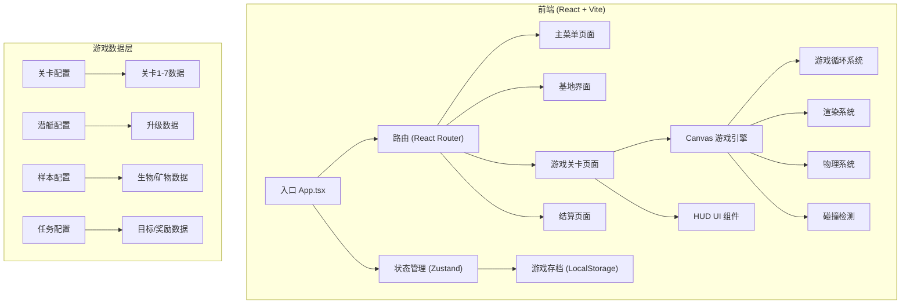
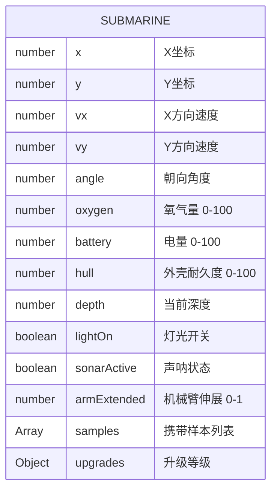
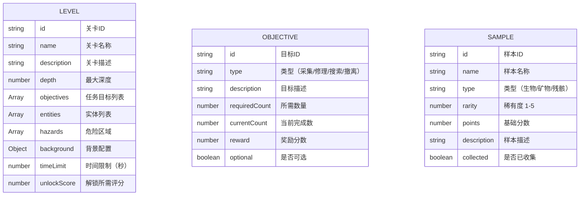
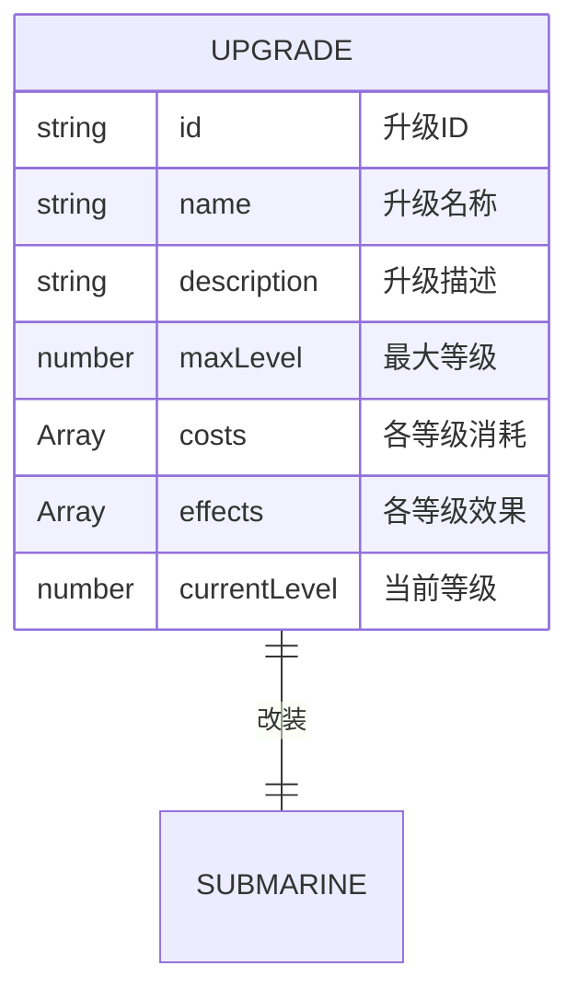

## 1. 架构设计



## 2. 技术选型

- **前端框架**：React@18 + TypeScript
- **构建工具**：Vite@5
- **样式方案**：TailwindCSS@3 + CSS Modules
- **状态管理**：Zustand（轻量级，适合游戏状态）
- **路由**：React Router DOM@6
- **游戏渲染**：HTML5 Canvas 2D API
- **图标**：Lucide React
- **字体**：Orbitron（标题）+ JetBrains Mono（正文）
- **后端**：无（纯客户端游戏，LocalStorage存档）
- **数据库**：无（本地存储）

## 3. 目录结构

```
src/
├── components/          # UI组件
│   ├── base/           # 基础组件（按钮、进度条等）
│   ├── hud/            # HUD组件（资源条、任务面板）
│   ├── menu/           # 菜单组件
│   └── upgrade/        # 改装组件
├── game/               # 游戏核心逻辑
│   ├── engine.ts       # 游戏引擎主循环
│   ├── submarine.ts    # 潜艇类
│   ├── level.ts        # 关卡管理
│   ├── entities/       # 游戏实体
│   │   ├── Sample.ts   # 样本类
│   │   ├── Creature.ts # 生物类
│   │   ├── Hazard.ts   # 危险物类
│   │   └── Item.ts     # 物品类
│   ├── systems/        # 游戏系统
│   │   ├── Sonar.ts    # 声呐系统
│   │   ├── Resource.ts # 资源管理
│   │   ├── Physics.ts  # 物理系统
│   │   └── Collision.ts# 碰撞检测
│   └── renderer/       # 渲染系统
│       ├── Renderer.ts # 主渲染器
│       └── effects/    # 特效（气泡、光晕等）
├── store/              # 状态管理
│   ├── useGameStore.ts # 游戏状态
│   └── useSaveStore.ts # 存档状态
├── data/               # 游戏配置数据
│   ├── levels.ts       # 关卡配置
│   ├── upgrades.ts     # 升级配置
│   ├── samples.ts      # 样本配置
│   └── missions.ts     # 任务配置
├── types/              # TypeScript类型定义
│   ├── game.ts
│   └── entities.ts
├── utils/              # 工具函数
│   ├── math.ts
│   ├── storage.ts
│   └── constants.ts
├── pages/              # 页面组件
│   ├── MainMenu.tsx
│   ├── Base.tsx
│   ├── GameLevel.tsx
│   └── Settlement.tsx
├── App.tsx
├── main.tsx
└── index.css
```

## 4. 路由定义

| 路由 | 页面 | 功能 |
|------|------|------|
| / | MainMenu | 主菜单页面 |
| /base | Base | 基地界面（任务/改装/日志） |
| /level/:id | GameLevel | 游戏关卡页面 |
| /settlement | Settlement | 结算评分页面 |

## 5. 核心数据模型

### 5.1 潜艇状态数据模型



### 5.2 关卡数据模型



### 5.3 升级系统数据模型



## 6. 游戏核心系统接口

### 6.1 游戏引擎接口

```typescript
interface GameEngine {
  start(): void;
  pause(): void;
  resume(): void;
  stop(): void;
  update(deltaTime: number): void;
  render(ctx: CanvasRenderingContext2D): void;
  handleInput(input: InputState): void;
}
```

### 6.2 资源管理接口

```typescript
interface ResourceSystem {
  oxygen: number;
  battery: number;
  hull: number;
  
  consumeOxygen(amount: number): boolean;
  consumeBattery(amount: number): boolean;
  repairHull(amount: number): boolean;
  takeDamage(amount: number): boolean;
  isDepleted(): boolean;
}
```

### 6.3 声呐系统接口

```typescript
interface SonarSystem {
  active: boolean;
  range: number;
  cooldown: number;
  
  ping(): SonarResult[];
  update(deltaTime: number): void;
}

interface SonarResult {
  type: 'sample' | 'creature' | 'hazard' | 'beacon';
  x: number;
  y: number;
  distance: number;
  size: number;
}
```

### 6.4 存档系统

```typescript
interface GameSave {
  playerName: string;
  currentLevel: number;
  unlockedLevels: string[];
  upgrades: Record<string, number>;
  collectedSamples: string[];
  collectedLogs: string[];
  highScores: Record<string, number>;
  totalCredits: number;
}
```
